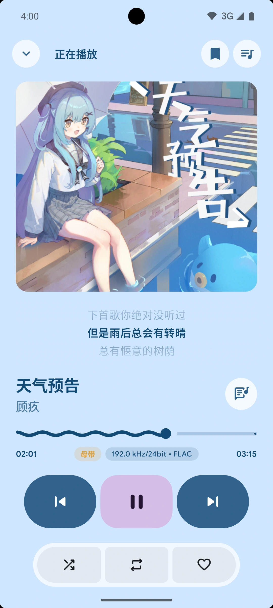
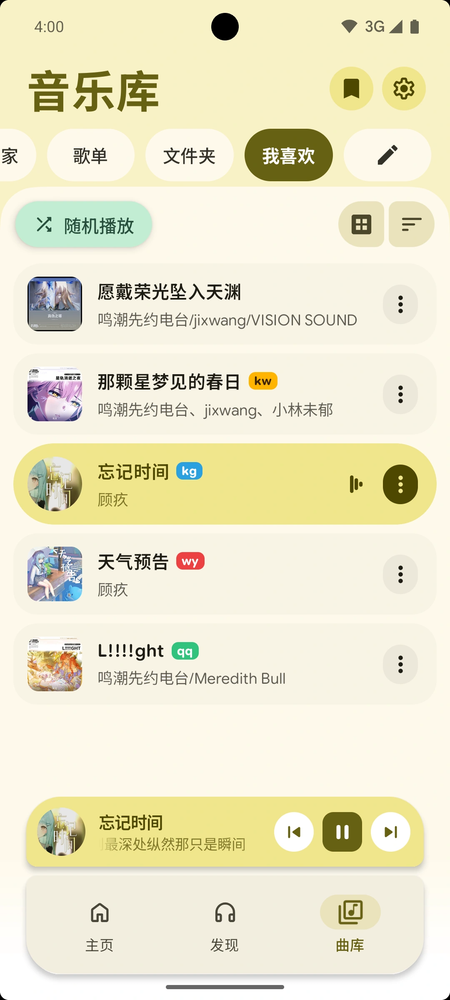
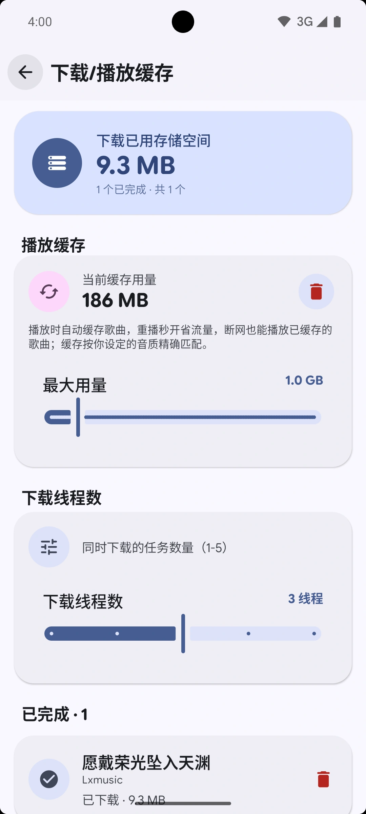
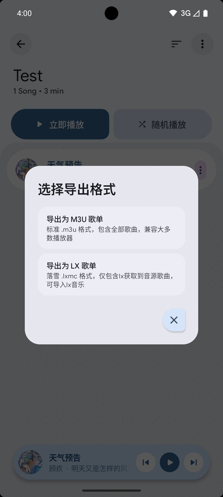

<p align="center">
  <a href="README.en.md">English</a> | <strong>简体中文</strong>
</p>

<p align="center">
  
</p>

<h1 align="center">PixelPlayerOLX</h1>

<p align="center">
  <a href="https://github.com/MiNoMinoaa/PixelPlayerOLX/releases/latest">
    
  </a>
  
  
</p>

<p align="center">
  一款安卓音乐播放器，派生自 <a href="https://github.com/PixelPlayerHQ/PixelPlayerOSS">PixelPlayerOSS</a>，
  新增了与 <a href="https://github.com/lyswhut/lx-music-mobile">lx-music-mobile</a> 兼容的在线音源（自定义音源）与播放列表互通的导入/导出等功能。
</p>

> **注意：** PixelPlayerOLX 是一个独立的派生项目。它**不是** PixelPlayerOSS、lx-music-mobile、lx-lxwalnut-music-mobile 或任何音乐平台的官方版本，也未获得上述原作者的背书。

<p align="center">本软件实现了lx音源导入播放平台在线功能仅用于满足个人需求自用，且只有在导入并启用音源脚本时平台在线功能方可生效，本软件不托管、不存储、不拥有任何受版权保护的音频内容</p>

## 软件截图

<p align="center">
  
  
  
  
</p>

## 简介

PixelPlayerOLX 派生自 [PixelPlayerOSS](https://github.com/PixelPlayerHQ/PixelPlayerOSS)。它保留了上游项目以本地播放、可自托管为核心的基础，并新增了一套在线音源（自定义音源 / "Lx音乐"）系统，其设计参考了 [lx-music-mobile](https://github.com/lyswhut/lx-music-mobile) 和 [lx-lxwalnut-music-mobile](https://github.com/WalnutBai/lx-lxwalnut-music-mobile)。

本地播放、自托管媒体库和离线使用默认可用。在线音源功能是可选的，只有在你导入并启用音源脚本（或登录支持的平台）后才会生效。

包名：`com.minoppol.music`


PixelPlayerOSS 坚持 FOSS（自由开源软件）方向，移除了不属于该方向的集成（Telegram、网易云、QQ 音乐、Google Drive、Gemini、投屏、Wear OS、Play 商店付费、Firebase、Crashlytics 以及 Google Play 服务的运行时依赖）。

PixelPlayerOLX 在这套 FOSS 基础之上，加回了一套*可选的、由用户掌控的*在线音源系统，实现时参考了 [lx-music-mobile](https://github.com/lyswhut/lx-music-mobile) 和 [lx-lxwalnut-music-mobile](https://github.com/WalnutBai/lx-lxwalnut-music-mobile)：

- 一个沙箱化的 **QuickJS** 脚本引擎，用于运行兼容 lx-music-mobile 的音源脚本。
- 内置多个平台的官方 API 路径，与脚本配合使用，以选出可用的最佳音质。
- 对需要登录的平台提供基本的登录。
- 支持 `.lxmc` 歌单导入/导出，可与 lx-music-mobile 共享歌单。

离线/自托管体验始终是本应用的核心。

## 功能

### 继承自 PixelPlayerOSS

| 方面 | 亮点 |
| --- | --- |
| 播放 | Media3 播放引擎、FFmpeg 支持、无缝播放、淡入淡出、自定义过渡、队列控制、随机播放、循环播放、睡眠定时、外部文件播放 |
| 媒体库 | 本地扫描 MP3、FLAC、AAC、OGG、WAV、M4A，支持专辑、艺术家、流派、文件夹、收藏、歌单、统计数据与元数据编辑 |
| 自托管 | 支持 Navidrome/Subsonic 与 Jellyfin 登录、同步、串流、封面以及应用私有目录的离线下载 |
| 歌词 | 内嵌歌词、本地 `.lrc` 文件、歌词导入/编辑、可选的 LRCLIB 联网查询 |
| 封面 | 本地封面、专辑封面配色提取、可选的 Deezer 艺术家图片查询 |
| 元数据 | 按需通过 MusicBrainz 匹配录音、发行版与艺术家标识符 |
| 界面 | Jetpack Compose、Material 3、动态取色、浅色/深色主题、Glance 小部件、带动画的播放界面 |
| 备份 | 偏好设置、歌单、收藏、歌词、统计数据与应用状态的备份/恢复 |

### PixelPlayerOLX 新增

| 方面 | 亮点 |
| --- | --- |
| 在线音源 | 兼容 lx-music-mobile 的音源脚本，可从 `.js` 文件或 URL 导入，在应用内"Lx音乐"页管理 |
| 脚本引擎 | 沙箱化 QuickJS 运行时（`user-api-preload.js` 桥接），脚本间相互隔离，支持 lx-music 的 `lx_setup` API |
| 平台 | 内置各大平台的web浏览路径；音源脚本还可声明更多来源 |
| 音质 | 分平台选择音质（母带、杜比全景声、24bit FLAC、FLAC、320kbps、128kbps），支持自动降档/回退 |
| 歌单 | 导入/导出 `.lxmc`（落雪 / lx-music）歌单，可与 lx-music-mobile 互通 |
| 下载 | 下载在线曲目并可选音质，音源歌曲还提供缓存/离线路径 |
| 账号 | 对支持的平台提供基于web的基本登录后的公开数据展示服务 |

## Lx音乐音源（自定义音源）

"Lx音乐"页让你通过**音源脚本**搜索并播放来自在线平台的音乐。音源脚本就是一个普通的 JavaScript 文件，实现了 lx-music-mobile 的音源 API（`lx_setup`）。

- 脚本运行在相互隔离的 QuickJS 实例中，某个脚本缓慢或失败不会影响其他脚本。
- 你可以启用多个音源：优先尝试首选脚本，然后是已启用的备选脚本，最后是内置官方 API 路径——以可用的最佳音质为准。
- 你可以从本地 `.js` 文件或 URL 导入脚本，启用/停用脚本，以及删除脚本（长按脚本）。

> **安全提示：** 部分脚本会要求你登录。请只使用你信任的脚本。

## 在线服务与数据来源

| 服务 | 用途 | 默认状态 |
| --- | --- | --- |
| Navidrome/Subsonic | 自托管媒体库同步、串流与离线下载 | 需用户登录 |
| Jellyfin | 自托管媒体库同步、串流与离线下载 | 需用户登录 |
| Lx音乐音源 | 通过导入的音源脚本进行可选的在线搜索/播放 | 启用脚本前关闭 |
| 各平台 | 官方 Web 服务 | 使用前关闭 |
| MusicBrainz | 按需匹配元数据并补充标识符 | 仅在请求时 |
| LRCLIB | 当缺少本地或内嵌歌词时联网搜索歌词 | 开启 |
| Deezer | 获取缺失的艺术家图片并缓存到本地 | 关闭 |
| ListenBrainz | 可选的 scrobble 记录（含自托管的 Maloja 兼容服务器） | 关闭 |

LRCLIB 和 Deezer 部分默认开启，也可以之后在 `设置 > 音乐管理 > 可选在线服务` 中开启/关闭。


## 下载

版本发布在 GitHub：

```text
https://github.com/MiNoMinoaa/PixelPlayerOLX/releases
```

安装正式版时，下载适合你设备的 APK 并安装：`arm64-v8a` 适用于绝大多数现代设备，`armeabi-v7a` 适用于较老的 32 位设备。

## 上游项目与署名

PixelPlayerOLX 派生自 [PixelPlayerOSS](https://github.com/PixelPlayerHQ/PixelPlayerOSS)。部分在线音源功能在实现时参考了 [lx-music-mobile](https://github.com/lyswhut/lx-music-mobile) 和 [lx-lxwalnut-music-mobile](https://github.com/WalnutBai/lx-lxwalnut-music-mobile)。相关许可证与版权均予以保留。

| 项目 | 仓库 | 许可证 | 版权 / 署名 |
| --- | --- | --- | --- |
| PixelPlayerOSS | https://github.com/PixelPlayerHQ/PixelPlayerOSS | GPL-3.0 | 版权所有 © 2026 Theo Vilardo |
| Pixel Player（PixelPlayerOSS 的上游） | — | — | Logo/设计署名归 **Aureal** |
| lx-music-mobile | https://github.com/lyswhut/lx-music-mobile | Apache-2.0 | 版权所有 © lyswhut |
| lx-lxwalnut-music-mobile | https://github.com/WalnutBai/lx-lxwalnut-music-mobile | Apache-2.0 | 版权所有 © WalnutBai |

本项目的 Lx音乐音源脚本系统兼容 lx-music-mobile 的音源 API，并参考其实现（Apache-2.0）。未从 lx-music-mobile 或 lx-lxwalnut-music-mobile 派生任何代码。

## 图标署名与第三方声明

本项目的应用图标是基于以下开源音乐播放器项目的图标资源创作的衍生作品：

- **lx-music-mobile**  
  仓库：https://github.com/lyswhut/lx-music-mobile  
  许可证：Apache License 2.0  
  原始图标资源在 Apache License 2.0 下被使用和修改。  
  lx-music-mobile 同时声明，其项目中包含的部分图片、字体及其他资源可能来自互联网，未必归项目本身所有。

- **PixelPlayerOSS**  
  仓库：https://github.com/PixelPlayerHQ/PixelPlayerOSS  
  许可证：GNU General Public License v3.0 (GPL-3.0)  
  据 PixelPlayerOSS 项目所述，原始图标/Logo 设计署名归 **Aureal**。

本仓库中经过组合/修改的图标仅用于标识、署名及衍生作品记录。  
本项目**不是** lx-music-mobile 或 PixelPlayerOSS 的官方版本，也未获得其原作者背书。

所有相关版权归原作者所有。  
如果你是此处所用资源的版权持有者，并希望要求移除或修改，请提交 issue 或联系仓库维护者。

## 免责声明——请尊重版权

在线音源功能通过第三方平台的公开 API 以及用户提供的音源脚本来获取数据。本项目：

- 不托管、不存储、不拥有任何受版权保护的音频内容。
- 无法核实第三方音源或脚本所返回内容的合法性、准确性或授权情况。
- 免费提供，仅用于技术学习与研究，与任何音乐平台无从属关系，也未获其背书。
- 应在遵守当地法律及所访问平台条款的前提下使用。

**请尊重版权，支持官方平台。** 请勿以侵犯艺术家、唱片公司或平台权益的方式使用本软件。只使用你获授权使用的音源脚本与账号。

## 参与贡献

欢迎贡献。请提交改动聚焦的 issue 或 pull request，并尽可能附上测试/构建结果。

本地可用的检查命令：

```sh
./gradlew :app:compileDebugKotlin
./gradlew :app:lintDebug
./gradlew :app:testDebugUnitTest
```

规范约定见 [CONTRIBUTING.md](CONTRIBUTING.md)，漏洞报告见 [SECURITY.md](SECURITY.md)。

隐私政策：[PRIVACY.md](PRIVACY.md)

## 致谢

感谢以下项目及其维护者对开源社区的贡献：

- [PixelPlayerOSS](https://github.com/PixelPlayerHQ/PixelPlayerOSS)
- [lx-music-mobile](https://github.com/lyswhut/lx-music-mobile)
- [lx-lxwalnut-music-mobile](https://github.com/WalnutBai/lx-lxwalnut-music-mobile)
- 各位音源脚本维护者

## 许可证

PixelPlayerOLX 基于 [GNU General Public License v3.0](LICENSE) 授权（`SPDX-License-Identifier: GPL-3.0-or-later`）。

```
PixelPlayerOLX
Copyright (C) 2026 MiNoMinoaa

This program is free software: you can redistribute it and/or modify
it under the terms of the GNU General Public License as published by
the Free Software Foundation, either version 3 of the License, or
(at your option) any later version.

This program is distributed in the hope that it will be useful,
but WITHOUT ANY WARRANTY; without even the implied warranty of
MERCHANTABILITY or FITNESS FOR A PARTICULAR PURPOSE.  See the
GNU General Public License for more details.

You should have received a copy of the GNU General Public License
along with this program.  If not, see <https://www.gnu.org/licenses/>.
```

PixelPlayerOLX 派生自 PixelPlayerOSS（GPL-3.0，版权所有 © 2026 Theo Vilardo）。部分在线音源功能在实现时参考了 lx-music-mobile（Apache-2.0，版权所有 © lyswhut）和 lx-lxwalnut-music-mobile（Apache-2.0，版权所有 © WalnutBai），并在各自许可证下使用。

分发的 APK 包含以各自许可证授权的第三方组件。特别地，可选的 FFmpeg 解码依赖 `org.jellyfin.media3:media3-ffmpeg-decoder` 为 GPL-3.0；详见 [THIRD_PARTY_NOTICES.md](THIRD_PARTY_NOTICES.md)。

<p align="center">
  由 <a href="https://github.com/MiNoMinoaa">MiNoMinoaa</a> 维护
</p>
